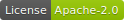
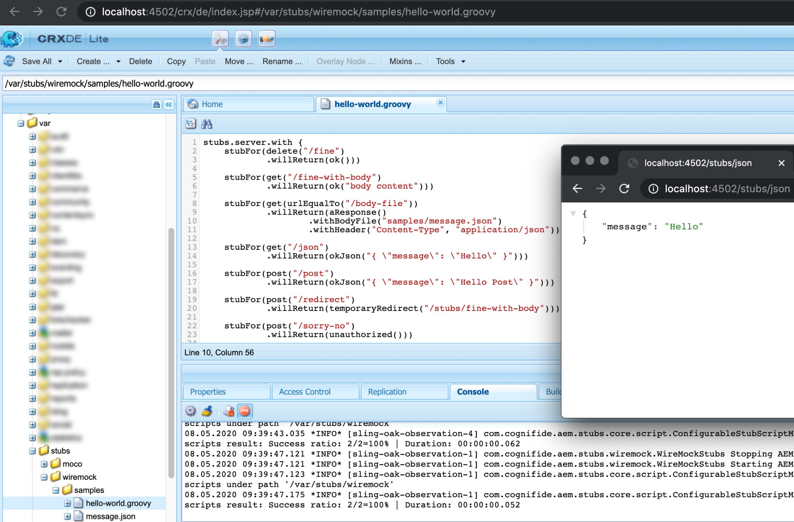
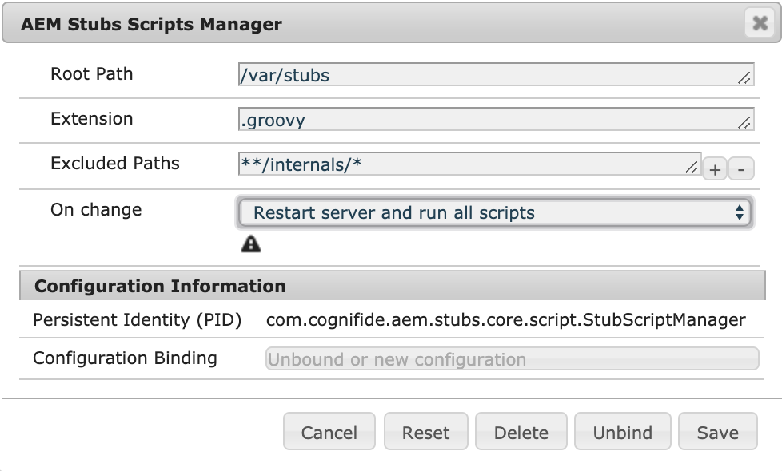

[](http://cognifide.com)


[](http://www.apache.org/licenses/)

# AEM Stubs

Tool for providing sample data for AEM applications in a simple and flexible way.

By implementing a [Groovy](http://groovy-lang.org/syntax.html) script using [WireMock](http://wiremock.org) or [Moco](https://github.com/dreamhead/moco) framework be able to mock your 3rd party services within minutes without a need to set up separate mock servers (infrastructure).

Simply [install](#installation) ready-to-use CRX package on AEM instance and start stubbing!



## Table of contents

  * [Frameworks](#frameworks)
  * [Installation](#installation)
  * [Compatibility](#compatibility)
  * [Building](#building)
  * [Documentation](#documentation)
     * [OSGi configuration](#osgi-configuration)
     * [Stub script API](#stub-script-api)
        * [Pre-defined variables:](#pre-defined-variables)
        * [Useful snippets:](#useful-snippets)
  * [Other tools](#other-tools)
  * [Contributing](#contributing)
  * [License](#license)

## Frameworks

At first, it is needed to decide which framework is more preferred to use.
Both frameworks have their own pros and cons, see comparison:

| Topic \ Framework | WireMock                   | Moco                                                   | Comments                                                                                                                                                                                                                                                                                                                                                                                                                    |  |  |
|-------------------|----------------------------|--------------------------------------------------------|-----------------------------------------------------------------------------------------------------------------------------------------------------------------------------------------------------------------------------------------------------------------------------------------------------------------------------------------------------------------------------------------------------------------------------|--|--|
| Installation      | All-in-one AEM package     | All-in-one AEM package                                 | Both distributions could be easily deployed via single package installation in CRX Package Manager.                                                                                                                                                                                                                                                                                                                         |  |  |
| HTTP server       | AEM built-in (Jetty)       | Separate running also on AEM at dedicated port (Netty) | As of Moco is not using AEM HTTP Server but running its own (faster, asynchronous), it is required to ensure that port<br>used by Moco is free and not blocked by firewall on some deployment servers.<br>As of WireMock is running on same server as AEM, all mocked paths need to be prefixed (by default with `stubs/`).<br>When using Moco prefixes are not needed as of it is a dedicated HTTP server with mocks only. |  |  |
| Popularity        | Big - 3.9k stars on GitHub | Big - 3.1k stars on GitHub                             | WireMock is a little bit more popular and has probably better documentation and more materials available on the web.                                                                                                                                                                                                                                                                                                                |  |  |
| API               | Rich, old-fashioned        | Rich, modern                                           | Moco API seems to be written with extendability in mind. Has many interfaces, builders etc available. WireMock API has less such extension points and generally does not look so elegant.                                                                                                                                                                                                                                   |  |  |

After choosing framework, it is recommended to explore dedicated AEM Stubs **framework related documentation**:

* [AEM Stubs - WireMock](wiremock)
* [AEM Stubs - Moco](moco)

However, keep in mind using both frameworks on AEM is also supported. It may be useful when some features are missing in one framework, but they are available in another one.

## Installation

Simply install ready to use AEM package downloaded from GitHub [releases](https://github.com/Cognifide/aem-stubs/releases) section.

Distribution types:

* all - both frameworks with Groovy OSGi bundle included,
* app - both frameworks without Groovy OSGi bundle included.
* wiremock-all - WireMock framework only with Groovy OSGi bundle included,
* wiremock-app - WireMock framework only without Groovy OSGi bundle included.
* moco-all - Moco framework only with Groovy OSGi bundle included,
* moco-app - Moco framework only without Groovy OSGi bundle included.

## Compatibility

| AEM Stubs | AEM          |
|-----------|--------------|
| 1.x       | 6.4.x, 6.5.x |

Note that AEM Stubs are **not** based on [AEM Groovy Console](https://github.com/icfnext/aem-groovy-console). It is done intentionally, because Groovy Console has close dependencies to concrete AEM version.
AEM Stubs tool is implemented in a AEM version agnostic way, to make it more universal and more error-prone when AEM version is changing. 

## Building

Project build is based on [Gradle](https://docs.gradle.org/current/userguide/userguide.html) and using [Gradle AEM Plugin](https://github.com/Cognifide/gradle-aem-plugin).

To setup AEM instance, provide details required by running command:

```bash
sh gradlew props
```

Fill opened GUI dialog, then click execute button.

To build CRX package and deploy it on AEM instance, simply run command:

```bash
sh gradlew
```

That's it.

## Documentation

### OSGi configuration

There are framework specific OSGi configurations ([WireMock](moco#osgi-configuration), [Moco](moco#osgi-configuration)) and common listed below:

[Stub Script Manager](http://localhost:4502/system/console/configMgr/com.cognifide.aem.stubs.core.script.StubScriptManager)


  
### Stub script API

#### Pre-defined variables:

* [stubs](core/src/main/java/com/cognifide/aem/stubs/core/Stubs.java) - use it to control actual Stubs server ([WireMock](wiremock/src/main/java/com/cognifide/aem/stubs/wiremock/WireMockStubs.java) or [Moco](moco/src/main/java/com/cognifide/aem/stubs/moco/MocoStubs.java)),
* [resourceResolver](https://sling.apache.org/apidocs/sling11/org/apache/sling/api/resource/ResourceResolver.html) - for accessing AEM repository,
* [repository](core/src/main/java/com/cognifide/aem/stubs/core/script/Repository.java) - for easier using repository e.g reading file contents,
* [logger](https://github.com/qos-ch/slf4j/blob/master/slf4j-api/src/main/java/org/slf4j/Logger.java) - SLF4j logger connected to script being run.

#### Useful snippets:

Snippets below might be useful only when script manager's 'On change' mode is set to 'Run changed script only'.
Then consider putting following snippets in the top of stub script.

Clearing all stubs defined then restarting WireMock Server:

```groovy
stubs.clear()
```

Restarting WireMock Server then executing all stub scripts:

```groovy
stubs.reset()
```

See also framework-specific stub script API: [Wiremock](wiremock#stub-script-api), [Moco](wiremock#stub-script-api).

## Other tools

There are no other dedicated tools for stubbing data available for AEM and it was main purpose to create AEM Stubs tool.

## Authors

* [Krystian Panek](mailto:krystian.panek@cognifide.com) - Project Owner, Main Developer,
* [Piotr Marcinkowski](mailto:piotr.marcinkowski@cognifide.com) - Main Developer.

## Contributing

Issues reported or pull requests created will be very appreciated. 

1. Fork plugin source code using a dedicated GitHub button.
2. Do code changes on a feature branch created from *develop* branch.
3. Create a pull request with a base of *develop* branch.

## License

**AEM Stubs** is licensed under the [Apache License, Version 2.0 (the "License")](https://www.apache.org/licenses/LICENSE-2.0.txt)
