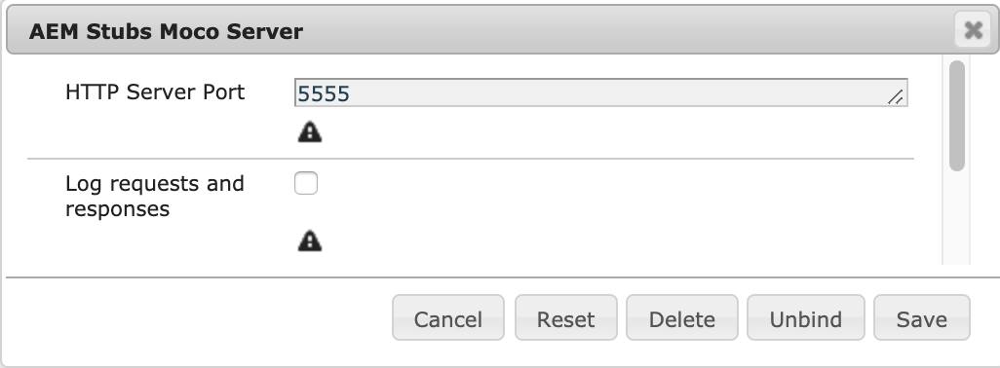

# AEM Stubs - Moco

Allows providing stubs (or mocks) by implementing [Groovy](http://groovy-lang.org/syntax.html) script basing on [Moco](https://github.com/dreamhead/moco) framework.

Sample **stub script**:

```groovy
stubs.server
        .get(by(uri("/hello-world")))
        .response("Hello! I am sample stub.")

stubs.server
        .get(
                and(
                        by(uri("/secured")),
                        eq(query("password"), "secret")
                )
        )
        .response("Secured endpoint revealed!")

stubs.server
        .get(by(uri("/current-date")))
        .response(template('Today date is "${date}"', "date", suppliedVar({ new Date() })))
```

## Table of contents

  * [Installation](#installation)
  * [Documentation](#documentation)
     * [OSGi configuration](#osgi-configuration)
     * [Stub script API](#stub-script-api)
  * [Useful links](#useful-links)
  * [Known issues](#known-issues)

## Installation

Download appropriate distribution from [releases](https://github.com/Cognifide/aem-stubs/releases) section:

* moco-all - Moco framework only with Groovy OSGi bundle included,
* moco-app - Moco framework only without Groovy OSGi bundle included.
* all - Moco and WireMock frameworks with Groovy OSGi bundle included,
* app - Moco and WireMock frameworks without Groovy OSGi bundle included.

## Documentation

To create stubs for web services or more basically mock any data, it is needed to only create a **stub script** under pre-configured path, e.g */var/stubs/moco/hello.groovy*.

```
stubs.server
        .get(by(uri("/hello-world")))
        .response("Hello! I am sample stub.")
```

Above stub will be accessible at URL <http://localhost:5555/hello-world>. 
Note that port 5555 is configurable via OSGi configuration.

### OSGi configuration

Be aware of common / Moco agnostic [OSGi configuration](../README.MD#osgi-configuration) at first.

Then check see Moco specific OSGi configuration below:

[Moco Stubs](http://localhost:4502/system/console/configMgr/com.cognifide.aem.stubs.moco.MocoStubs)

    

### Stub script API

At first, see [common](../#stub-script-api) script API.

Pre-defined variables:

* [stubs.server](https://github.com/dreamhead/moco/blob/master/moco-core/src/main/java/com/github/dreamhead/moco/HttpServer.java) - use it to define Moco stubs.

Default imports (not needed to be specified explicitly in scripts):

* [_com.github.dreamhead.moco.Moco.\*_](https://github.com/dreamhead/moco/blob/master/moco-core/src/main/java/com/github/dreamhead/moco/Moco.java) - base Moco API,
* [_com.cognifide.aem.stubs.moco.MocoUtils.\*_](moco/src/main/java/com/cognifide/aem/stubs/moco/MocoUtils.java) - AEM Stubs related extensions for Moco API.

## Useful links

* https://github.com/dreamhead/moco/blob/master/moco-doc/apis.md


## Known issues

None.
